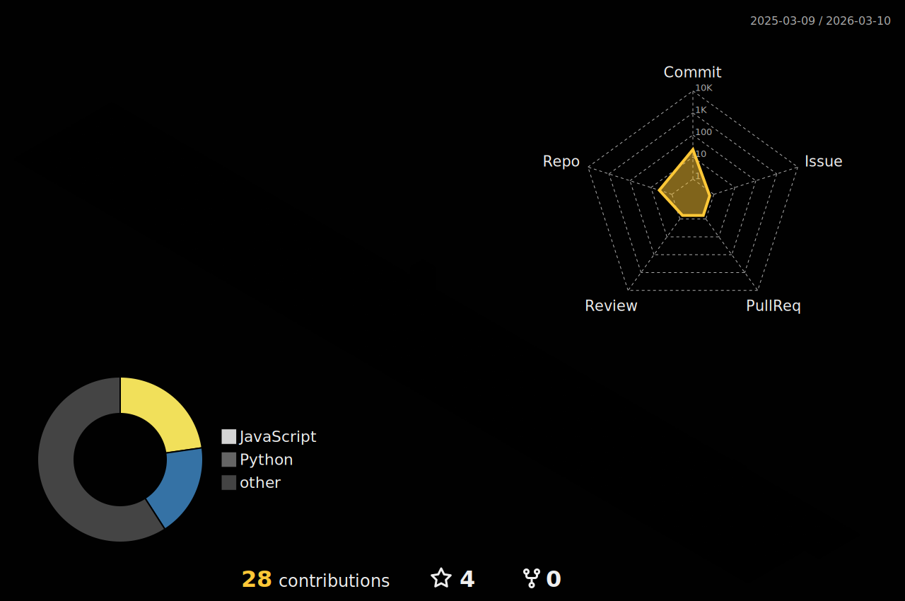

  

  

  
  
  
  
  
  
  
  

  

  

  
  
  
  
  
  
  
  

  
  
  
  
  
  
  
  

  
  
  
  
  
  
  
  

  
  
  
  
  
  
  
  

  
  
  
  
  
  
  

  

  

  
  
  
  

  
  
  
  

  
  
  
  

  

  

  
  
  
  

  
  
  
  

  

  

  

  

  

  

  
  
  
  

  
  
  
  

  

  

  
  
  
  

  

  

  
  
  
  

  
  
  
  

  

  

  
  
  
  

  
  
  
  

