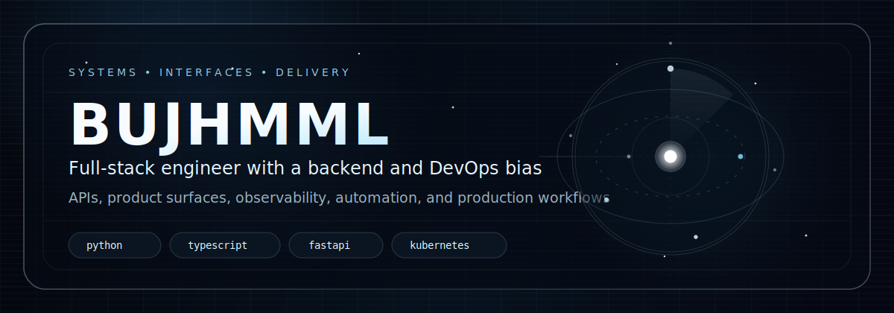
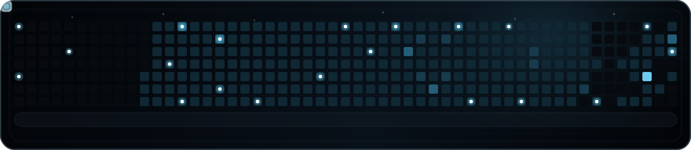

  

  Backend-first engineer shipping reliable APIs, internal platforms, and delivery pipelines.
   
  Comfortable across product UI, observability, automation, and data-heavy workflows.

  <code>Python</code>
  <code>TypeScript</code>
  <code>FastAPI</code>
  <code>Node.js</code>
  <code>React</code>
  <code>PostgreSQL</code>
  <code>Redis</code>
  <code>Docker</code>
  <code>Kubernetes</code>
  <code>GitHub Actions</code>

  

<h2 align="center">Core Focus</h2>

<table align="center" cellpadding="12">
  <tr>
    <td width="440" valign="top">
      <strong>Backend / APIs / Integrations</strong> 
      FastAPI, Django, Node.js, GraphQL, OpenAPI, PostgreSQL, Redis, RabbitMQ. 
      Services built for clear contracts, steady latency, and predictable failure modes.
    </td>
    <td width="440" valign="top">
      <strong>Frontend / Product UI</strong> 
      React, Next.js, TypeScript, dashboards, internal tools, and product-facing surfaces. 
      Interfaces tuned for dense workflows without adding noise.
    </td>
  </tr>
  <tr>
    <td width="440" valign="top">
      <strong>DevOps / Delivery / Infra</strong> 
      Docker, Kubernetes, Linux, Nginx, CI/CD, observability, release automation. 
      Delivery paths designed for cleaner rollouts and faster feedback.
    </td>
    <td width="440" valign="top">
      <strong>Data / Automation / Parsing</strong> 
      ETL, scraping, headless automation, reporting, extraction pipelines, workflow tooling. 
      Turning repetitive operations and messy sources into stable systems.
    </td>
  </tr>
</table>

  

<h2 align="center">Contributions / Activity</h2>

  Activity assets are generated independently: snake stays in <code>dist/</code>, and the official GitHub skyline STL is generated into <code>assets/skyline/</code>.
   
  Automation details live in <a href="./docs/profile-assets.md"><code>docs/profile-assets.md</code></a>.

<h3 align="center">GitHub Skyline</h3>

  This profile now uses the official <code>github/gh-skyline</code> GitHub CLI extension.
   
  The first successful run of <a href="./.github/workflows/skyline.yml"><code>skyline.yml</code></a> writes the real STL artifact to <code>assets/skyline/bujhmml-github-skyline.stl</code>.
   
  GitHub renders STL files on their file page, so this README intentionally avoids a fake SVG preview.

<h3 align="center">Snake</h3>

  <picture>
    <source media="(prefers-color-scheme: dark)" srcset="./dist/github-contribution-grid-snake-dark.svg" />
    <source media="(prefers-color-scheme: light)" srcset="./dist/github-contribution-grid-snake.svg" />
    
  </picture>

  

<h2 align="center">Contact</h2>

  <a href="mailto:igorbelevskiy12@gmail.com"><code>email</code></a>
  ·
  <a href="https://t.me/bujhmml"><code>telegram</code></a>
  ·
  <a href="https://github.com/bujhmml?tab=repositories"><code>github</code></a>

  

<h2 align="center">Decorative Assets</h2>

  

  Calm systems, sharp interfaces, quieter on-call nights.

